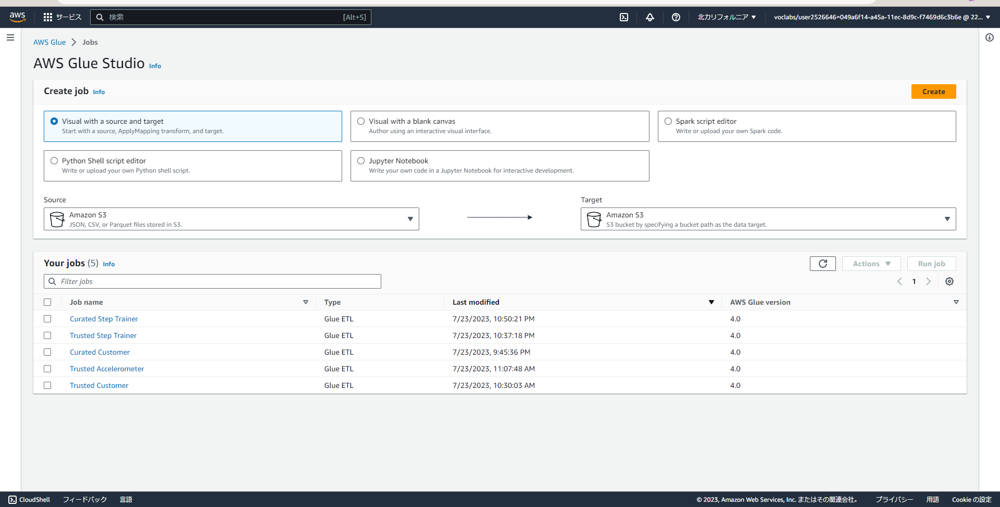

# Project : STEDI Human Balance Analytics
Project submission for Udacity Data Engineering Nanodegree - Data Lake House

## Introduction

In this project, you'll act as a data engineer for the STEDI team to build a data lakehouse solution for sensor data that trains a machine learning model.

## Datasets

STEDI has three JSON data sources to use from the Step Trainer. Check out the JSON data in this folders in the Github repo linked above

- customer
- step_trainer
- accelerometer

https://github.com/udacity/nd027-Data-Engineering-Data-Lakes-AWS-Exercises/tree/main/project/starter

Create Bucket S3 and copy data above 


## Installing AWS
Create vpc endpoint/ iam role/ policy 

``` bash
[cloudshell-user@ip-10-4-43-146 ~]$ aws ec2 create-vpc-endpoint --vpc-id vpc-00f3214ae6f37c974 --service-name com.amazonaws.us-west-1.s3 --route-table-ids rtb-01036620d00bcabef
{
    "VpcEndpoint": {
        "VpcEndpointId": "vpce-09bce13e743abf630",
        "VpcEndpointType": "Gateway",
        "VpcId": "vpc-00f3214ae6f37c974",
        "ServiceName": "com.amazonaws.us-west-1.s3",
        "State": "available",
        "PolicyDocument": "{\"Version\":\"2008-10-17\",\"Statement\":[{\"Effect\":\"Allow\",\"Principal\":\"*\",\"Action\":\"*\",\"Resource\":\"*\"}]}",
        "RouteTableIds": [
            "rtb-01036620d00bcabef"
        ],
        "SubnetIds": [],
        "Groups": [],
        "PrivateDnsEnabled": false,
        "RequesterManaged": false,
        "NetworkInterfaceIds": [],
        "DnsEntries": [],
        "CreationTimestamp": "2023-07-23T00:21:22+00:00",
        "OwnerId": "222812907893"
    }
}

[cloudshell-user@ip-10-4-43-146 ~]$ aws iam create-role --role-name my-glue-service-role --assume-role-policy-document '{
>     "Version": "2012-10-17",
>     "Statement": [
>         {
>             "Effect": "Allow",
>             "Principal": {
>                 "Service": "glue.amazonaws.com"
>             },
>             "Action": "sts:AssumeRole"
>         }
>     ]
> }'
{
    "Role": {
        "Path": "/",
        "RoleName": "my-glue-service-role",
        "RoleId": "AROATHYFPFF22BFEOU5PH",
        "Arn": "arn:aws:iam::222812907893:role/my-glue-service-role",
        "CreateDate": "2023-07-23T00:23:22+00:00",
        "AssumeRolePolicyDocument": {
            "Version": "2012-10-17",
            "Statement": [
                {
                    "Effect": "Allow",
                    "Principal": {
                        "Service": "glue.amazonaws.com"
                    },
                    "Action": "sts:AssumeRole"
                }
            ]
        }
    }
}

[cloudshell-user@ip-10-4-43-146 ~]$ aws iam put-role-policy --role-name my-glue-service-role --policy-name GlueAccess --policy-document '{
>     "Version": "2012-10-17",
>     "Statement": [
>         {
>             "Effect": "Allow",
>             "Action": [
>                 "glue:*",
>                 "s3:GetBucketLocation",
>                 "s3:ListBucket",
>                 "s3:ListAllMyBuckets",
>                 "s3:GetBucketAcl",
>                 "ec2:DescribeVpcEndpoints",
>                 "ec2:DescribeRouteTables",
>                 "ec2:CreateNetworkInterface",
>                 "ec2:DeleteNetworkInterface",
>                 "ec2:DescribeNetworkInterfaces",
>                 "ec2:DescribeSecurityGroups",
>                 "ec2:DescribeSubnets",
>                 "ec2:DescribeVpcAttribute",
>                 "iam:ListRolePolicies",
>                 "iam:GetRole",
>                 "iam:GetRolePolicy",
>                 "cloudwatch:PutMetricData"
>             ],
>             "Resource": [
>                 "*"
>             ]
>         },
>         {
>             "Effect": "Allow",
>             "Action": [
>                 "s3:CreateBucket",
>                 "s3:PutBucketPublicAccessBlock"
>             ],
>             "Resource": [
>                 "arn:aws:s3:::aws-glue-*"
>             ]
>         },
>         {
>             "Effect": "Allow",
>             "Action": [
>                 "s3:GetObject",
>                 "s3:PutObject",
>                 "s3:DeleteObject"
>             ],
>             "Resource": [
>                 "arn:aws:s3:::aws-glue-*/*",
>                 "arn:aws:s3:::*/*aws-glue-*/*"
>             ]
>         },
>         {
>             "Effect": "Allow",
>             "Action": [
>                 "s3:GetObject"
>             ],
>             "Resource": [
>                 "arn:aws:s3:::crawler-public*",
>                 "arn:aws:s3:::aws-glue-*"
>             ]
>         },
>         {
>             "Effect": "Allow",
>             "Action": [
>                 "logs:CreateLogGroup",
>                 "logs:CreateLogStream",
>                 "logs:PutLogEvents",
>                 "logs:AssociateKmsKey"
>             ],
>             "Resource": [
>                 "arn:aws:logs:*:*:/aws-glue/*"
>             ]
>         },
>         {
>             "Effect": "Allow",
>             "Action": [
>                 "ec2:CreateTags",
>                 "ec2:DeleteTags"
>             ],
>             "Condition": {
>                 "ForAllValues:StringEquals": {
>                     "aws:TagKeys": [
>                         "aws-glue-service-resource"
>                     ]
>                 }
>             },
>             "Resource": [
>                 "arn:aws:ec2:*:*:network-interface/*",
>                 "arn:aws:ec2:*:*:security-group/*",
>                 "arn:aws:ec2:*:*:instance/*"
>             ]
>         }
>     ]
> }'

```

## Implementation 

1. Using SQL to create tables
    Please ref to more detail 
2. Create Job 
    
  Please ref to more detail 
3. Run Job to build data
    


